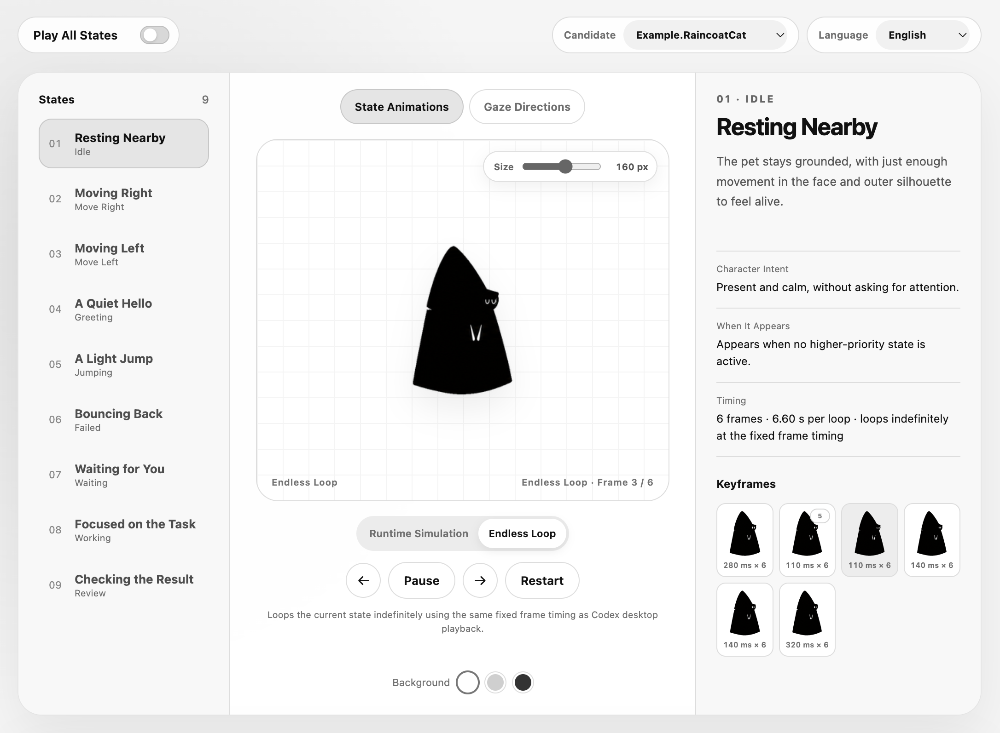

# Codex Pet Studio

Codex Pet Studio is a complete co-design suite for creating custom
Codex pets with *your own Codex locally*, combining **guided agent skills, a live Previewer,
production tooling, and QA** in one project.



## Start a blank Codex task and paste:

> I want to use this GitHub project to design my own Codex pet:
> https://github.com/thevoidorange/codex-pet-studio. I do not use Git or the
> terminal. Please set up the project for me and guide me one creative decision
> at a time. Open the bundled Previewer as soon as setup is ready. Start from
> my inspiration, reflect the essentials briefly, then make the smallest useful
> static character study as soon as you have enough direction. Use images
> rather than a long questionnaire to align each major decision. Do not
> generate the full pet yet.

That is the entire setup flow.

Codex prepares a private local workspace, opens
the Previewer on `Example.RaincoatCat`, asks for your inspiration, and then uses
the bundled skill to guide one visual decision at a time.

Beyond access to Codex, the recommended flow requires no terminal, separate Pet Studio backend
or account, or separate OpenAI API key.

## Model guidance

- **Recommended for the full experience: GPT‑5.6 Sol, Medium+.**
- **For demanding visual and animation work: GPT‑5.6 Sol, High or Ultra.**
- **Not recommended: GPT‑5.6 Luna or any model at Low effort.** The minimum
  usable fallback is GPT‑5.6 Terra, Medium, for bare-bones workflow completion
  only.

These are experience recommendations, not technical compatibility gates.
After setup succeeds, your Codex should proactively summarize these
recommendations once, in the order above, before the first creative decision.

## What the first session feels like

Codex does not begin by producing a complete animation pack.

It asks only what is needed to make the first useful visual decision. It then
briefly reflects back:

- what it can directly observe;
- what it thinks matters about the character;
- which visual and behavioral qualities should survive;
- which generic or unwanted directions to avoid;
- the one decision worth making next.

As soon as there is enough direction, Codex makes a small static character
study. The first image is exploratory: it gives you something concrete to
correct and does not imply approval. Codex does not wait for a complete written
brief, run a questionnaire to the end, or combine the whole character, behavior
system, and animation pack into one all-in-one reveal.

The Previewer is already open on `Example.RaincoatCat` during this first
creative exchange. When your first useful image exists, Codex places the exact
image in a private Static Candidate, switches the Previewer directly to it,
and checks that you are now looking at your project rather than the bundled
Example. You do not need a spritesheet or nine finished states first.

The process then uses focused images to align default form, relationship and
emotional stance, variable mechanisms, state acting, and motion before
production. Steps may combine or loop; approved work is not silently replaced.
After each visual checkpoint, Codex stops for your correction or selection
before moving into the next dependent layer unless you explicitly ask to
combine them.

## How to work with Codex

You can speak naturally:

> I like the second direction, but keep the first one's brim.

> This frame needs a lower head. Do not move the hem.

> Make two more Takes for the frame I am looking at.

> This is the one. Keep these details fixed and continue.

> Validate and install this pet in Codex.

Codex should know what is already locked, what remains open, and what the
current Previewer link is focused on. Reopening the same local project in a new
task should restore that context from its private files rather than restart
from inspiration.

## The Previewer

Codex opens the local Previewer immediately after project setup. It begins on
`Example.RaincoatCat`, then switches to your first real Static Candidate as
soon as one exists. It helps you:

- review one Static character image and its Takes before animation exists;
- compare Candidates without losing an approved direction;
- play and compare whichever runtime states have actually been made;
- pause on an exact Keyframe;
- audition multiple Takes for that Keyframe;
- inspect real runtime cadence, loop seams, gaze, and desktop display sizes;
- give feedback such as “change this” without restating technical context.

The Previewer is intentionally read-only. It does not generate, upload, save,
package, install, or publish assets.

Every asset that enters the Previewer is a transparent review or runtime
derivative. Codex preserves the exact creative source separately, then uses
the bundled `prepare-transparent-assets` skill for background separation,
smooth alpha, hidden-RGB cleanup, and edge-color decontamination. This shared
step applies to Static, Takes, and production—not only the final hatch.

Clicking a Take only auditions it. Previewer Confirm remembers a temporary
choice for that browser session. To approve a visual decision, say so in the
Codex conversation; Codex records the exact asset and the details that must
remain unchanged.

The review surface grows with the work:

```text
Example.RaincoatCat
  -> first project Static image
  -> one or more real runtime states
  -> complete target state set
  -> validated package
```

Static is a single image, not a disguised animation state. Runtime states
appear only when their real assets exist. The Previewer never duplicates a row,
invents a placeholder, or borrows the bundled Example to make a project look
complete. Completing every Codex Pet state is required later for delivery, not
for early review.

## The creative workflow

The studio resolves six practical questions:

1. **Inspiration** — what feels specific and worth preserving?
2. **Character** — what makes the default form unmistakable?
3. **Mechanisms** — what may move, fold, stretch, hide, or relocate?
4. **States** — how does each action express a different intention?
5. **Motion** — how do weight, material, stillness, and settling feel?
6. **Delivery** — does the selected Candidate pass visual, motion, pack, and
   privacy QA?

Each round should show the smallest artifact that resolves the current
uncertainty. Rejected options remain useful evidence. An approved Candidate is
preserved before material changes continue.

Multimodal alignment is the core method: a prose brief may frame the question,
but it does not replace a visual checkpoint when the decision concerns form,
mechanism, acting, emotion, or motion.

## What “finished” means

A file existing is not the same as a finished pet. Codex Pet Studio keeps these
outcomes separate:

- the art was generated;
- the exact result was reviewed;
- the user approved it;
- character and motion QA passed;
- the Codex Pet package validated;
- the package was staged or exported;
- the user explicitly requested installation and it was verified;
- the user separately authorized publication.

The current release delivers **Codex Pet v2** packages. Its animation slots and
runtime cadence come from the Codex client, so Codex designs the acting inside
those real constraints instead of inventing settings the pet cannot carry.
Those exact checked-in constraints live in one machine-readable Delivery
Target contract; the CLI, Previewer, validators, and QA derive from it.

## Privacy and ownership

The public repository contains the workflow, tools, Raincoat Cat Example, and
templates. Private inspiration, design decisions, generated Candidates,
builds, and exports stay in ignored local folders.

Codex should never publish personal photos, names, home interiors, local paths,
credentials, private skills, or identifying metadata without explicit,
reviewed permission. Public examples and finished community pets also require
reviewed rights.

See [SECURITY.md](SECURITY.md) and [CONTRIBUTING.md](CONTRIBUTING.md) for the
project's reporting and contribution policies.

## For manual setup and contributors

If you prefer a manual checkout, clone or create a repository from this project
and open it in Codex. The core readiness check is:

```bash
python3 .agents/skills/pet-studio/scripts/studio.py doctor
```

Verify that the selected Delivery Target and its static Previewer adapter are
in sync with:

```bash
python3 .agents/skills/pet-studio/scripts/studio.py target check
```

Start the local Previewer with:

```bash
python3 .agents/skills/pet-studio/scripts/studio.py preview
```

To preserve the first exact source and stage its prepared transparent
derivative as a reviewable Candidate:

```bash
python3 .agents/skills/pet-studio/scripts/studio.py review stage-static \
  --asset path/to/character-study.png \
  --preview-asset path/to/character-study-transparent.png \
  --candidate <semantic-candidate-id> \
  --default
```

The command copies the exact source and transparent review derivative into the
ignored local build, references only the derivative from the validated
Previewer config, and returns the focused project URL. Codex chooses the
Candidate ID and display name from the actual idea. Candidate names are
semantic, not sequential release numbers: two Candidates may be different
directions or entirely different pets.

The core Studio CLI and Previewer are intentionally inspectable and
dependency-free. Final pet production uses Codex's built-in image generation
and bundled Python/Pillow workspace runtime; users do not install or configure
those separately. Useful entry points:

- [Product model](docs/product-model.md) — roles, domain model, and the
  Studio Core / Delivery Target boundary
- [Codex Pet v2 contract](delivery-targets/codex-pet-v2.json) — the canonical
  checked-in geometry, state, cadence, lifecycle, and display facts
- [Agent instructions](AGENTS.md) — repository routing, privacy, and operating
  rules
- [Pet Studio Skill](.agents/skills/pet-studio/SKILL.md) — the detailed
  creative, review, production, and QA method
- [Prepare Transparent Assets Skill](.agents/skills/prepare-transparent-assets/SKILL.md)
  — shared background separation and alpha-edge cleanup for every review and
  production stage
- [Hatch Pet Skill](.agents/skills/hatch-pet/SKILL.md) — the bundled
  deterministic Codex Pet v2 production compiler and validator
- [Previewer](previewer/) — the bilingual read-only review workbench
- [Templates](templates/) — reusable private decision artifacts
- [Raincoat Cat](examples/raincoat-cat/) — complete public Codex Pet v2 Example
- [Tests](tests/) — core and production regression coverage

The architecture keeps approved creative work separate from platform-specific
sampling, but Codex Pet v2 is the only supported Delivery Target today. Future
targets should be added only after they work end to end.

## License

Repository code, documentation, and templates are available under the
[MIT License](LICENSE), except for the two bundled skill subtrees noted here.
The bundled Hatch Pet skill remains available under its included
[Apache License 2.0](.agents/skills/hatch-pet/LICENSE.txt). It is a vendored
OpenAI skill snapshot modified for project-local, build-first use; its license
and modification notice are preserved in that subtree. The shared Prepare
Transparent Assets skill includes refactored Hatch Pet edge-cleanup code and
is available under its included
[Apache License 2.0](.agents/skills/prepare-transparent-assets/LICENSE.txt);
its [modification notice](.agents/skills/prepare-transparent-assets/NOTICE.txt)
is preserved in that subtree.

That license does not grant rights to third-party characters, trademarks,
photographs, or reference material. Generated pet assets may require their own
permission and attribution record.

Codex Pet Studio is an independent community project and is not affiliated
with or endorsed by OpenAI.
